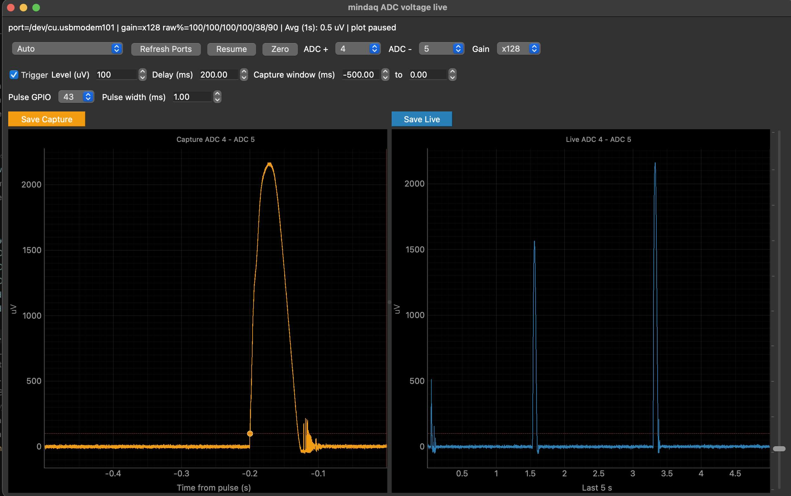

# Mindaq Capture GUI



This GUI streams voltage data from the Mindaq, shows a live rolling plot, and records trigger-aligned captures like an oscilloscope. It also pulses a GPIO pin a configurable delay after the trigger to align external devices (e.g. slow motion camera). Mindaq must be running the capture firmware.

## Usage

Download [capture_gui.py](https://raw.githubusercontent.com/qwertpas/mindaq/main/scripts/capture/capture_gui.py).


Install python libraries if you don't have them:

```bash
python3 -m pip install pyserial pyqtgraph PyQt5
```

On Windows, use `py` if that is how Python is installed:

```powershell
py -3 -m pip install pyserial pyqtgraph PyQt5
```


Start the GUI:

```bash
python3 capture_gui.py
```

On Windows:

```powershell
py -3 capture_gui.py
```

The GUI normally finds the USB serial port automatically. To force a port:

```bash
python3 capture_gui.py --port /dev/cu.usbmodem101
```

On Windows:

```powershell
py -3 capture_gui.py --port COM3
```

## Plots

- Live plot (orange): shows the selected ADC voltage over the last 5 seconds. Data is displayed at 1 kHz.
- Capture plot (blue): shows the most recent trigger capture, aligned so GPIO pulse start is at time 0. Data is displayed at 1 kHz.

## Buttons and Settings

- Zeroing: Sets a baseline voltage as a 0 reading by subtracting the average voltage over the last 1 second.
- Avg (1s): Text display of the average voltage over the last 1 second average after zeroing.
- Live plot: shows the selected ADC voltage over the last 5 seconds. Data is displayed at 1 kHz.
- Capture plot: shows the most recent trigger capture, aligned so GPIO pulse start is at time 0. Data is displayed at 1 kHz.
- Trigger level: set in microvolts using the numeric field or vertical slider.
- Delay: this amount of time after the trigger threshold crossing, the GPIO pulse starts and is used as the reference for when `capture_time_s` = 0.
- Capture window: you can configure the time window to display and save before and after `capture_time_s` = 0. Default is -500ms to 0ms, meaning it saves and displays the last 500ms before the GPIO pulse start.
- Pulse GPIO: select the GPIO pin to pulse. See labels on the [back of the PCB](https://github.com/qwertpas/mindaq/blob/main/media/v1_back.jpg).
- Pulse width: configurable duration of the GPIO pulse.
- Save Capture: saves the capture window at full 32 kHz sampling rate.
- Save Live: saves the current live buffer at full 32 kHz sampling rate.
- The firmware turns on the built-in red LED when a trigger is accepted and turns it off when the pulse is done.

## Saved CSV data format

Basic:
- `capture_time_s`: time relative to the GPIO pulse start (trigger threshold crossing plus the configured delay). 0 matches the red pulse-start line in the capture plot. The events you care about are likely when `capture_time_s` is slightly negative. <u>Use this to align external devices (e.g. slow motion camera).</u>
- `voltage_zeroed_uv`: Measured voltage after subtracting the current zero offset.
- `voltage_uv`: Measured voltage before zeroing.
- `device_time_s`: Mindaq precise device time since it was powered on.
- `datetime`: wall-clock timestamp estimated from the computer time when saved, used to check roughly when experiment was done. Not as accurate, use `device_time_s` or `capture_time_s` instead for precise timing.

Capture timing columns:
- `trigger_time_s`: device time when the signal crossed the trigger threshold.
- `pulse_start_time_s`: device time when the GPIO pulse starts.
- `pulse_end_time_s`: device time when the GPIO pulse ends.
- `trigger_threshold_uv`: trigger threshold.
- `trigger_cross`: `1` on the sample nearest the trigger crossing.
- `pulse_start`: `1` on the sample nearest pulse start.
- `pulse_active`: `1` for samples during the pulse if the capture window includes them.
- `trigger_gpio`: selected output pin.
- `trigger_edge`: currently always `Rising`, but noise makes it activate on falling edges too.

For debugging:
- `seq`: sample sequence number.
- `pos_channel`, `neg_channel`: selected ADC inputs.
- `adc_N_uv`, `adc_N_raw`: per-channel microvolts and raw ADC counts, paired by channel.
- `gain_code`, `warn_flags`, `clip_flags`: stream metadata.

It then includes the same selected channel, per-ADC, gain, warning, and clipping metadata as the live CSV.
