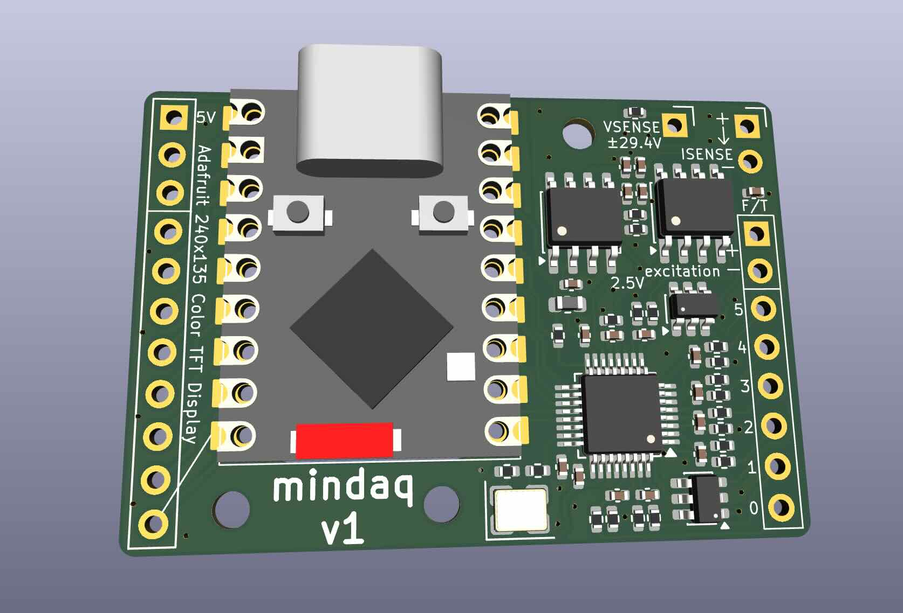
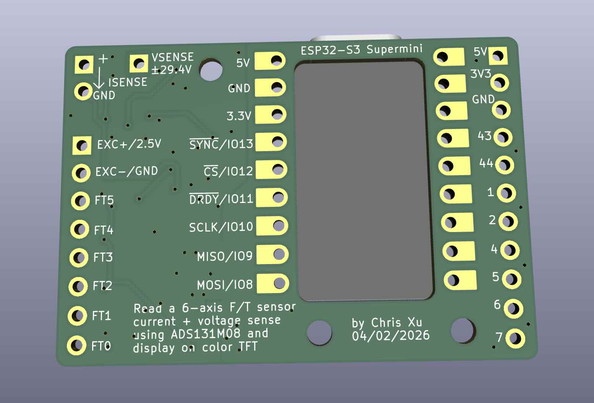

# mindaq PCB

A cheap and minimal data aquisition system for reading 6-axis force/torque sensors at high rates.

- 2.5V strain gauge excitation using precision reference (REF5025)
- Simultaneous sampling 24-bit ADC (ADS131M08) with 8 channels at 32k samples/second for
    - 6x strain gauges
    - 1x voltage up to 29.4V 
    - 1x current using external low-side shunt resistor
- Controlled by ESP32S3 Supermini dev board (USB-C powered)
- Display live force/torque data on Adafruit color TFT
- 42 x 29 mm board size
- 2-layer, single side components, JLCPCB economic assembly
- About $11 in parts cost per board (including ESP32S3)
- Single order of 2pcs is $70, 5pcs is $120 including everything (shipping and customs about doubles the cost!) 

